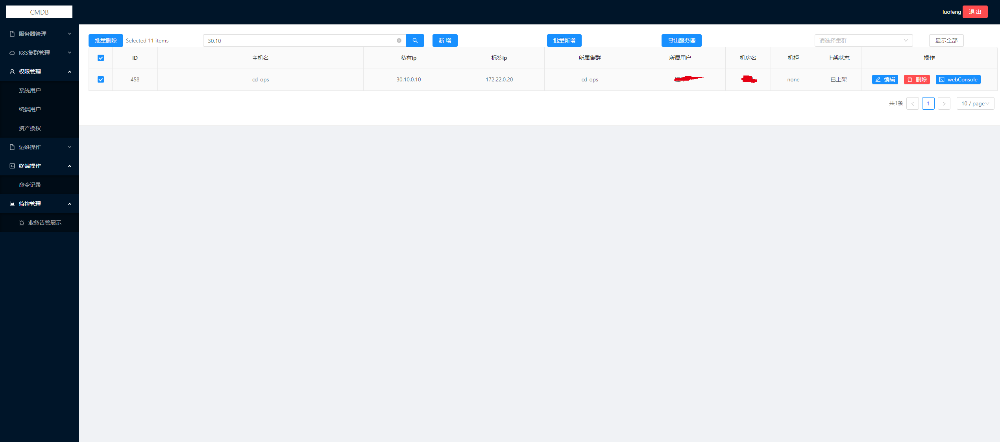

# cmdb

## 后端：

###  基于golang的CMDB

### 基于机房的资产收集，服务器，交换机，路由器

###  支持不同应用环境初始化

###  支持自动录入，以及手动录入数据库

###  支持不同应用管理

###  监控管理，通过cmdb联动到prometheus

###  机柜机房拓扑展示

###  基于jwt-go 实现用户认证

###  简单的权限管理

###  基于ansible进行批量管理

###  支持k8s集群管理

###  支持webssh，堡垒机权限管理，日志审计

## 前端：

### vue2.x + Ant Design of Vue + js-file-download


### 效果图如下



### cmdb必须的目录结构
```shell
├── config
│   ├── config.ini		#cmdb配置文件
├── logs				#路径日志，可在cmdb中自定义
│   ├── cmdb-err.log
│   ├── cmdb.log
├── web
│   ├── dist			#前端存放位置
├── main				# cmdb二进制程序
```

### cmdb配置文件

``` shell
# cat config/config.ini 
[server]
AppMode = release
HttpPort = :5000		#运行端口
JwtKey = 89js82js72
LogFile = /data/ops/cmdb/logs/cmdb.log		#访问日志路径
ErrorLogFile= logs/cmdb-err.log				#错误日志路径
WorkerUser=ops								#批量操作的用户名
WorkerPass=2IQ%N^GUJKWZ@09Y					#批量操作的用户密码
WorkerSudoPass=2IQ%N^GUJKWZ@09Y				#批量操作的sudo用户密码
SR_File_Max_Bytes=1048576
PrometheusAddr=127.0.0.1:9090               #主prometheus地址
AnsibleHosts=/etc/ansible/hosts				#生成的机器列表
AnsiblePlaybookDir=/mnt/roles				#页面上ansibleplaybook任务所在目录
SshdPort=2222
[database]									#数据库必须配置
Db = mysql
DbHost = 172.22.0.20
DbPort = 3306
DbUser = root
DbPassWord = 123456 
DbName = cmdb

[ali]
AccessKey = aaaaa
SecretKey = 


[aws]
AccessKey =
SecretKey =

[k8s]
KubeFile=config/testkube.txt

[prometheus]
prometheus_config_dir = /data/monitor/conf/prometheus/targets
#被监控的机器ip所在目录，需要与prometheus配置文件相对应
```

### 数据库最好使用8.0

使用database目录下的init.sql初始化数据库

nohup ./main  &

启动成功后，默认管理员账号密码为  luofeng 12345678910